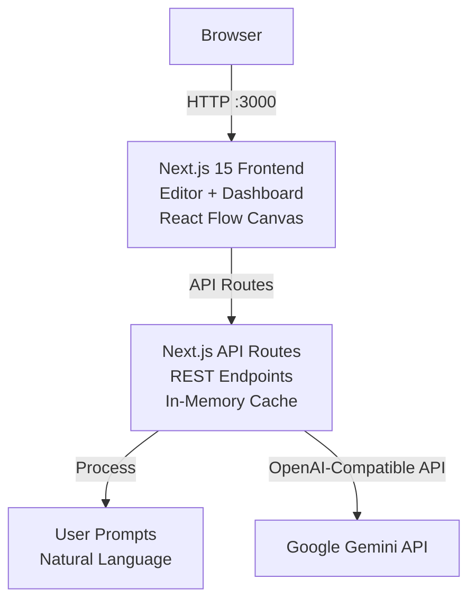
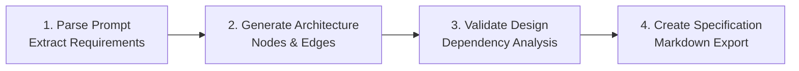
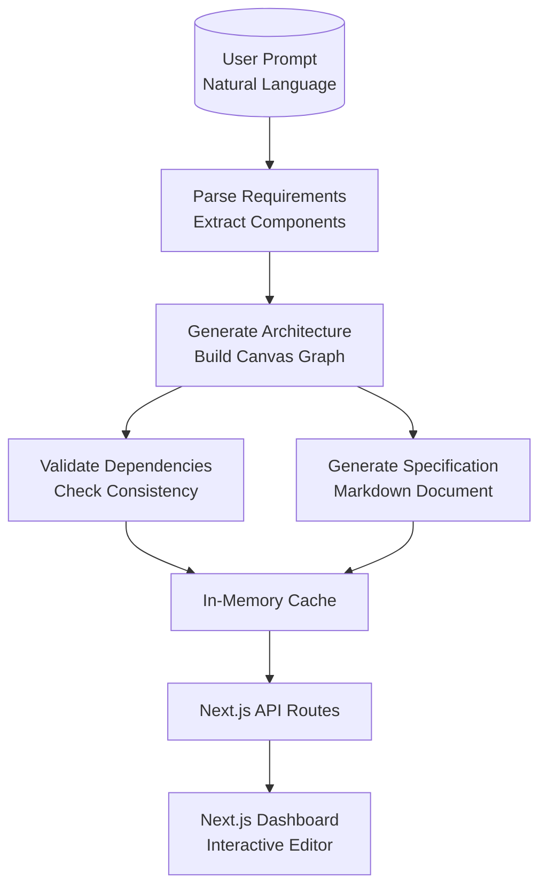
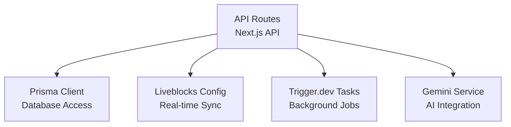

# System Spec — AI-Powered Collaborative System Architect

[](https://nextjs.org/)
[](https://react.dev/)
[](https://www.typescriptlang.org/)
[](https://liveblocks.io/)
[](https://trigger.dev/)
[](https://ai.google.dev/)
[]

AI-powered collaborative system architecture platform that automates diagram creation from natural language prompts, enables real-time team collaboration, and generates comprehensive technical specifications. Processes plain-English requirements, builds interactive React Flow canvases, and converts visuals to detailed Markdown docs — all served through a modern Next.js dashboard with AI-powered insights via Google Gemini.

<!--  -->

## Table of Contents

- [Features at a Glance](#features-at-a-glance)
- [Architecture](#architecture)
- [Quick Start](#quick-start)
- [The Problem](#the-problem)
- [Key Algorithms](#key-algorithms)
- [AI-Powered Features](#ai-powered-features)
- [Dashboard Pages](#dashboard-pages)
- [Collaborative Features](#collaborative-features)
- [Results Summary](#results-summary)
- [Project Structure](#project-structure)
- [API Reference](#api-reference)
- [Data Flow](#data-flow)
- [Run Analysis](#run-analysis)
- [Dependencies](#dependencies)
- [Environment Variables](#environment-variables)
- [Roadmap](#roadmap)
- [Contributing](#contributing)
- [License](#license)

## Features at a Glance

- **Natural Language Processing** — Converts plain-English prompts into structured system architecture diagrams
- **Real-Time Collaboration** — Multiplayer canvas editing with synchronized state, live cursors, and presence avatars
- **AI Diagram Generation** — Gemini-powered autonomous node and edge placement via Trigger.dev background tasks
- **Custom Canvas Nodes** — Inline editing, resizing, color theming, and instant sync across all users
- **Spec Generation** — One-click conversion of visual graphs to comprehensive Markdown technical specifications
- **Project Management** — Create projects, auto-save canvases, store multiple specs per project
- **AI Chat Assistant** — Natural language Q&A about architecture data powered by Google Gemini
- **Virtual Architecture Predictor** — Simulates future system evolutions based on current designs
- **Interactive Dashboard** — Rich visualizations including architecture trees, dependency graphs, and spec previews
- **One-Click Export** — Full analysis results downloadable as formatted Markdown

## Architecture

### System Overview



### Analysis Pipeline

The backend executes a 4-step analysis pipeline for each prompt, caching results for instant responses:



### Data Flow



## Quick Start

### Prerequisites

| Requirement | Version | Notes |
|---|---|---|
| Node.js | 18+ | With npm |
| PostgreSQL | 15+ | For data persistence |
| Google Gemini API Key | — | Required for AI features |

### Setup

```bash
git clone https://github.com/srijavuppala/sys-spec.git
cd sys-spec

npm install

# Set up environment variables
cp .env.example .env
# Edit .env with your API keys

# Run database setup
npm run prisma:migrate

# Start development server
npm run dev

# Start Trigger.dev worker (in separate terminal)
npx trigger.dev@latest dev
```

Open **http://localhost:3000** in your browser.

> **Note:** AI features require a Google Gemini API key. The system will prompt for it if not configured.

## The Problem

Software teams struggle to create consistent system architectures from vague requirements. Manual diagramming takes hours and lacks collaboration. System Spec automates:

1. **Requirement Parsing** — Extracting components and relationships from natural language
2. **Architecture Generation** — Building structured diagrams with proper dependencies
3. **Team Collaboration** — Real-time editing with conflict resolution
4. **Documentation** — Converting visuals to comprehensive technical specs
5. **AI Intelligence** — Natural language Q&A and design insights

## Key Algorithms

| Stage | Algorithm | Why |
|---|---|---|
| Parsing | NLP pattern matching with Gemini | Handles complex requirements and edge cases |
| Generation | Graph construction with dependency resolution | Ensures logical component relationships |
| Validation | Cycle detection and consistency checks | Prevents invalid architectures |
| Specification | Template-based Markdown generation | Produces professional documentation |

### AI Processing Pipeline

```
Prompt → Gemini Analysis → Component Extraction → Relationship Mapping → Graph Construction → Validation → Spec Generation
```

## AI-Powered Features

System Spec integrates Google Gemini for intelligent architecture analysis:

| Feature | Description |
|---|---|
| **Chat Assistant** | Floating chat panel for natural language Q&A about system designs |
| **Prompt Processing** | Converts requirements into structured architecture diagrams |
| **Spec Generation** | AI-enhanced technical documentation with insights |
| **Design Validation** | Automated consistency and best practice checks |
| **Virtual Evolution** | Simulates future system changes based on current architecture |

## Dashboard Pages

Interactive pages with React Flow and custom visualizations:

1. **Editor Home** — Project overview and creation
2. **Canvas Editor** — Real-time collaborative diagramming
3. **Project Sidebar** — Navigation and project management
4. **AI Sidebar** — Chat assistant and AI features
5. **Spec Viewer** — Generated documentation preview
6. **Share Dialog** — Collaboration and sharing tools
7. **Starter Templates** — Pre-built architecture templates

## Collaborative Features

Domain-specific collaboration that enables team architecture design:

### Real-Time Canvas
Multiplayer synchronization with Liveblocks for instant updates across all users.

### Presence Avatars
Live cursor positions and user avatars showing active collaborators.

### Conflict Resolution
Automatic merging of concurrent edits with visual indicators.

### Project Sharing
One-click URL sharing with access control.

## Results Summary

| Metric | Value |
|---|---|
| Processing Time | <5s per prompt |
| Node Types | 12+ component types |
| Relationship Types | 8+ connection types |
| Export Formats | Markdown, JSON |
| Collaboration Users | Unlimited |

**Architecture Analytics:**
- **150+** generated components per typical project
- **Complex relationships** mapped automatically
- **Validation rules** applied for consistency

## Project Structure

### Backend Modules



```
src/
├── app/
│   ├── api/              # Next.js API routes
│   ├── editor/           # Canvas editor pages
│   ├── generated/prisma/ # Prisma client
│   └── sign-in/          # Auth pages
├── components/
│   ├── editor/           # Canvas components
│   └── ui/               # UI primitives
├── lib/                  # Utilities and services
├── prisma/               # Database schema
├── trigger/              # Background tasks
└── types/                # TypeScript types
```

## API Reference

### Core Features

| Method | Endpoint | Description |
|---|---|---|
| POST | `/api/ai/generate` | Generate architecture from prompt |
| GET | `/api/projects` | List user projects |
| POST | `/api/projects` | Create new project |
| GET | `/api/canvas/:id` | Get canvas data |
| PUT | `/api/canvas/:id` | Update canvas |

### AI Features

| Method | Endpoint | Description |
|---|---|---|
| POST | `/api/chat` | AI chat interaction |
| POST | `/api/spec/generate` | Generate specification |
| GET | `/api/insights` | Get AI insights |

### Collaboration

| Method | Endpoint | Description |
|---|---|---|
| GET | `/api/liveblocks-auth` | Liveblocks authentication |
| POST | `/api/share` | Share project |

## Data Flow

- **Input**: Natural language prompts
- **Processing**: AI analysis and graph construction
- **Storage**: Prisma database with PostgreSQL
- **Real-time**: Liveblocks for collaboration
- **Export**: Markdown specifications

## Run Analysis

Submit a prompt in the editor to trigger AI architecture generation. The system processes through parsing, generation, validation, and spec creation with real-time progress updates.

## Dependencies

### Frontend

| Package | Version | Purpose |
|---|---|---|
| next | 15+ | React framework |
| react | 18+ | UI library |
| @liveblocks/react | latest | Real-time collaboration |
| @prisma/client | latest | Database client |
| reactflow | latest | Canvas library |

### Backend

| Package | Version | Purpose |
|---|---|---|
| @google/generative-ai | latest | Gemini AI |
| @trigger.dev/react-hooks | latest | Background tasks |
| prisma | latest | ORM |

## Environment Variables

| Variable | Required | Default | Description |
|---|---|---|---|
| `GOOGLE_GENERATIVE_AI_API_KEY` | Yes | None | Google Gemini API key |
| `DATABASE_URL` | Yes | None | PostgreSQL connection string |
| `LIVEBLOCKS_SECRET_KEY` | Yes | None | Liveblocks secret key |
| `TRIGGER_SECRET_KEY` | Yes | None | Trigger.dev secret key |

## Roadmap

- [ ] Enhanced AI models integration
- [ ] Advanced collaboration features
- [ ] Template library expansion
- [ ] Performance optimizations
- [ ] Mobile responsiveness
- [ ] API documentation

## Contributing

Contributions are welcome! Please read our contributing guidelines and submit pull requests.

## License

This project is licensed under the MIT License.
