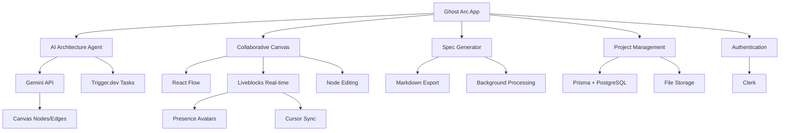
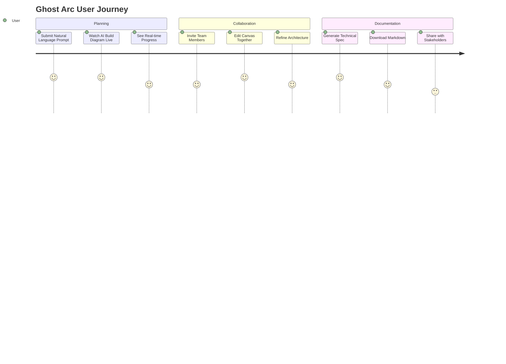
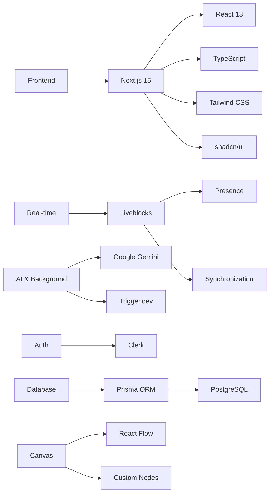

# System Spec

[](https://nextjs.org/)
[](https://react.dev/)
[](https://www.typescriptlang.org/)
[](https://tailwindcss.com/)
[](https://liveblocks.io/)
[](https://trigger.dev/)
[](LICENSE)

An agentic planning application for software teams — submit a natural-language prompt and watch a Google Gemini-powered AI agent autonomously build system architecture diagrams on a shared React Flow canvas in real-time. Collaborate with teammates, refine the design, then generate comprehensive Markdown technical specifications.

---

<div align="center">
  <h3>🌐 Live Demo at <strong><a href="https://ghost-arc.vercel.app">ghost-arc.vercel.app</a></strong></h3>
  <p><em>AI-Driven Architecture Planning · Real-Time Collaboration · Instant Specs</em></p>
</div>

---

## Architecture Overview



## User Experience Flow



## Key Features

### Core Functionality
- **AI Architecture Agent** — Submit plain-English prompts; Gemini autonomously creates nodes and edges on the live canvas
- **Real-Time Collaboration** — Multiplayer canvas with synchronized state, live cursors, and presence avatars
- **Custom Canvas Nodes** — Inline editing, resizing, color swatches, and instant sync across all users
- **AI Spec Generation** — One-click conversion of graphs into detailed, multi-page Markdown technical specifications
- **Project Management** — Create projects, auto-save canvases, store multiple specs per project
- **Authentication & Security** — Clerk-powered auth with route protection and secure Liveblocks tokens

### Technical Features
- **Next.js 15 + App Router** — Server-side rendering, API routes, and optimized performance
- **TypeScript** — Fully typed codebase with strict type checking
- **Liveblocks** — Real-time infrastructure for collaborative features
- **Trigger.dev** — Background job orchestration for AI tasks
- **Prisma + PostgreSQL** — Type-safe database interactions and data persistence
- **Tailwind CSS + shadcn/ui** — Modern, accessible UI components
- **React Flow** — Powerful diagramming library for the canvas

## Tech Stack



### Key Dependencies

| Package | Purpose |
|---|---|
| `next` | React framework with App Router |
| `react` + `react-dom` | UI library |
| `@liveblocks/react` | Real-time collaboration |
| `@trigger.dev/react-hooks` | Background task management |
| `@prisma/client` | Type-safe database client |
| `reactflow` | Diagramming canvas |
| `@google/generative-ai` | Gemini AI integration |
| `tailwindcss` | Utility-first styling |
| `@clerk/nextjs` | Authentication |

---

## Features Deep Dive

### AI Architecture Agent
- Natural language prompts (e.g., "Design a scalable e-commerce backend")
- Gemini-powered autonomous diagram creation via Trigger.dev background tasks
- Real-time canvas updates as AI places nodes and edges
- Liveblocks Node.js SDK for server-side canvas manipulation

### Real-Time Collaborative Canvas
- Full multiplayer synchronization powered by Liveblocks
- Live cursor positions and presence avatars for all connected users
- Instant sync of node/edge state, labels, and styling changes
- Conflict-free collaborative editing

### Custom Canvas Nodes
- Double-click inline editing of node labels
- NodeResizer for dynamic sizing
- 12 color swatches via floating NodeToolbar
- All changes synced across clients in real-time

### AI Spec Generation
- One-click conversion of visual graphs to comprehensive Markdown specs
- Second Gemini-powered Trigger.dev task for detailed documentation
- Multi-page specifications with architecture diagrams, component details, and implementation notes
- Downloadable via dedicated API routes

### Project Management
- Slide-in sidebar for project creation
- Auto-generated room IDs from project slugs
- Active room highlighting in navigation
- One-click URL sharing with copy confirmation

## Project Structure

```
src/
├── app/
│   ├── api/              # Next.js API routes (auth, AI, projects, specs)
│   ├── editor/           # Canvas editor pages
│   ├── generated/prisma/ # Auto-generated Prisma client
│   ├── sign-in/          # Clerk sign-in page
│   └── sign-up/          # Clerk sign-up page
├── components/
│   ├── editor/           # Canvas UI components (editor, sidebar, AI chat)
│   └── ui/               # Reusable shadcn/ui primitives
├── data/
│   ├── canvas/           # Auto-saved React Flow graph JSON per project
│   └── specs/            # Generated Markdown specs per project
├── docs/                 # Project documentation
├── hooks/                # Custom React hooks (auto-save, keyboard shortcuts)
├── lib/                  # Shared utilities (Prisma client, Liveblocks, AI agents)
├── prisma/               # Prisma schema and migrations
├── trigger/              # Trigger.dev background task definitions
│   ├── design-agent.ts   # AI canvas generation task
│   └── generate-spec-gemini.ts  # AI spec generation task
└── types/                # Shared TypeScript types
```

## Getting Started

```bash
# Clone the repository
git clone https://github.com/adrianhajdin/ghost-ai.git
cd ghost-ai

# Install dependencies
npm install

# Set up environment variables
cp .env.example .env
# Edit .env with your API keys

# Run database migrations
npm run prisma:migrate

# Start development server
npm run dev

# Start Trigger.dev worker (in separate terminal)
npx trigger.dev@latest dev
```

### Environment Variables

Create a `.env` file at the project root:

```env
# Clerk Authentication
NEXT_PUBLIC_CLERK_PUBLISHABLE_KEY=your_clerk_publishable_key
CLERK_SECRET_KEY=your_clerk_secret_key
NEXT_PUBLIC_CLERK_SIGN_IN_URL=/sign-in
NEXT_PUBLIC_CLERK_SIGN_UP_URL=/sign-up

# Liveblocks Real-time
LIVEBLOCKS_SECRET_KEY=your_liveblocks_secret_key

# Trigger.dev Background Tasks
TRIGGER_SECRET_KEY=your_trigger_secret_key
NEXT_PUBLIC_TRIGGER_PUBLIC_API_KEY=your_trigger_public_api_key

# Database
DATABASE_URL=your_postgresql_connection_string

# Google Gemini AI
GOOGLE_GENERATIVE_AI_API_KEY=your_gemini_api_key
GEMINI_MODEL=gemini-2.0-flash
GEMINI_SPEC_MODEL=gemini-2.0-flash

# App Configuration
APP_URL=http://localhost:3000
```

## Deployment

The application is deployed on Vercel with continuous deployment from GitHub.

### Vercel Configuration

```json
{
  "buildCommand": "npm run build",
  "outputDirectory": ".next",
  "installCommand": "npm install",
  "framework": "nextjs"
}
```

### Deploy via CLI

```bash
npx vercel --prod
```

## Browser Support

| Browser | Support |
|---|---|
| Chrome | ✅ Recommended |
| Firefox | ✅ Full support |
| Safari | ✅ Full support |
| Edge | ✅ Full support |

## Performance Highlights

- **Real-time Optimization** — Liveblocks handles state synchronization efficiently
- **Lazy Loading** — Canvas components load on demand
- **Background Processing** — AI tasks run asynchronously via Trigger.dev
- **Database Indexing** — Prisma schema optimized for fast queries
- **Code Splitting** — Next.js automatic route-based splitting

---

**Built with Next.js + AI** | **Powered by Gemini + Liveblocks** | **Deployed at [ghost-arc.vercel.app](https://ghost-arc.vercel.app)**
